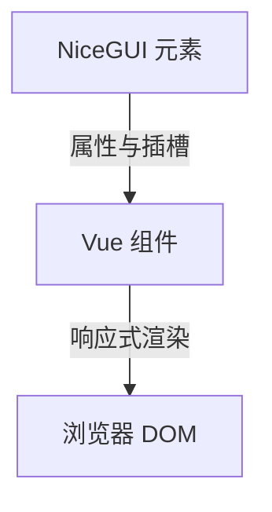
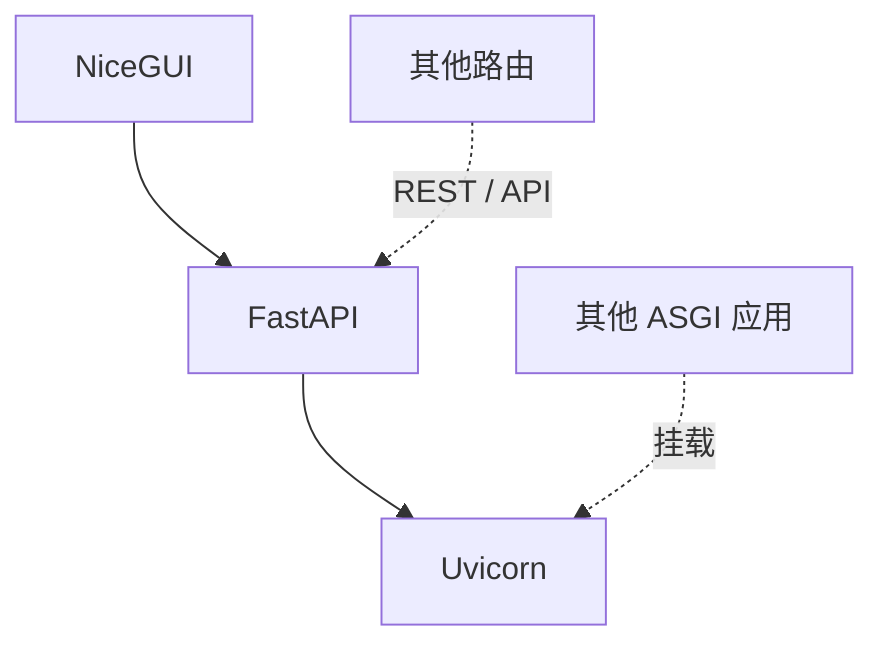
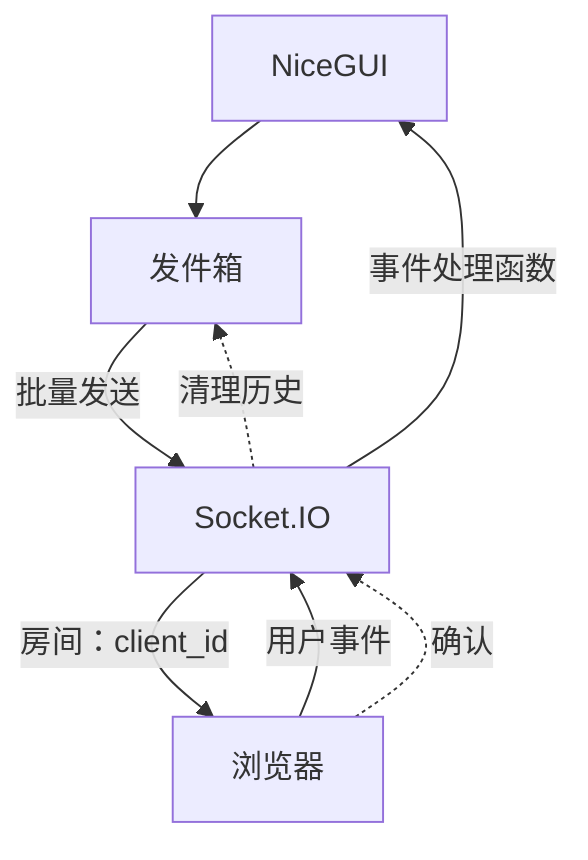

# 技术栈

NiceGUI 遵循后端优先理念：所有 UI 逻辑都在 Python 中编写，而框架负责处理所有 Web 开发细节。在底层，一套精心挑选的开源技术栈让这一切成为可能。

## UI 框架

### Vue.js

受 [JustPy](https://justpy.io/) 启发，你在 Python 中创建的每一个 [UI 元素](/documentation/elements/element)都会映射到浏览器中的一个 [Vue](https://vuejs.org/) 组件。Vue 的响应式模型带来了无缝的实时更新——当你的 Python 代码修改某个属性时，浏览器会立即更新。

如果内置元素还不够用，你可以[创建自己的 Vue 组件](/documentation/section_configuration_deployment#自定义-vue-组件)（参见[示例](https://github.com/zauberzeug/nicegui/tree/main/examples/custom_vue_component)）。

此外还有对接入 Element Plus 或 Vuetify 等[其他 Vue UI 框架](/documentation/section_styling_appearance#使用其他基于-vue-框架的-ui)的实验性支持，不过这需要一些动手工作，因为所有原生 NiceGUI 元素都依赖 Quasar。

## 组件库

### Quasar

[Quasar](https://quasar.dev/) 提供了 70 多个可用于生产环境的 Material Design UI 组件——从[按钮](/documentation/elements/button)、[输入框](/documentation/elements/input)到[对话框](/documentation/section_page_layout#对话框-dialog)和[表格](/documentation/section_data_elements#表格-table)。NiceGUI 将它们封装为 Python 元素，让你开箱即得精致的界面。

每个 NiceGUI 元素都将最常用的选项作为 `__init__` 参数公开。这些名称大多与 Quasar 中的对应名称一致，不过 NiceGUI 偶尔会为了清晰而重新命名（例如 `ui.switch` 封装的是 `q-toggle`）。Quasar 的全部 props 始终可以通过 [`.props()`](/documentation/section_styling_appearance#样式设计-styling) 使用。

探索丰富的[图标](/documentation/section_audiovisual_elements#图标-icon)、[布局](/documentation/section_pages_routing#页面布局-page-layout)和交互组件吧。

之所以选择 Quasar，是因为它提供了一个基于 Vue、功能全面、开箱即用的组件库——这样 NiceGUI 就能提供高级的 Python 元素，而无需从零重新实现每一个组件。

| NiceGUI       | Quasar       | `.props()` 示例              |
| ------------- | ------------ | ---------------------------- |
| `ui.button`   | `q-btn`      | `'flat color=red icon=star'` |
| `ui.slider`   | `q-slider`   | `'label-always snap'`        |
| `ui.checkbox` | `q-checkbox` | `'keep-color'`               |
| `ui.switch`   | `q-toggle`   | `'icon=alarm'`               |
| `ui.card`     | `q-card`     | `'bordered flat'`            |
| `ui.badge`    | `q-badge`    | `'floating color=negative'`  |
| `ui.tabs`     | `q-tabs`     | `'dense inline-label'`       |

## 后端

### FastAPI

NiceGUI 基于 [FastAPI](https://fastapi.tiangolo.com/) 构建，选择它是因为其出色的性能和开发体验。整个 ASGI 技术栈——基于 [Starlette](https://www.starlette.io/) 的 FastAPI，由 [Uvicorn](https://www.uvicorn.org/) 提供服务——让一切都保持快速且完全异步。

由于 NiceGUI 建立在一个真正的 Web 框架之上，你可以自由地将 UI 页面与 [REST API 端点](/documentation/section_pages_routing#api-响应)混合使用，使用 FastAPI 的[参数注入](/documentation/section_pages_routing#参数注入-parameter-injection)，或者通过 `ui.run_with()` 在[你自己的 FastAPI 应用之上](/documentation/section_pages_routing#api-响应)运行 NiceGUI。你还可以在同一个 Uvicorn 服务器上与 NiceGUI 一起挂载其他 ASGI 应用。

## 实时通信

### Socket.IO

NiceGUI 使用 [Socket.IO](https://socket.io/) 处理 Python 后端与浏览器之间的所有实时通信。Socket.IO 构建于 [Engine.IO](https://socket.io/docs/v4/engine-io-protocol/) 之上，并增加了普通 WebSocket 连接无法提供的功能：

- **传输降级**——Socket.IO 默认通过 WebSocket 连接，但在 WebSocket 不可用时（例如位于限制严格的代理或防火墙之后）会降级为 HTTP 长轮询。`socket_io_js_transports` 配置项控制提供哪些传输方式。
- **自动重连**——断开连接时，Socket.IO 会以指数退避加随机抖动的方式重新连接，从而避免惊群问题。
- **房间**——服务器可以把每个 socket 放入以其客户端 ID 为键的房间中，从而将消息定向发送给单个客户端。

### 发件箱（Outbox）

每个客户端都有一个发件箱，它在一个异步循环中批量处理元素更新和消息。发件箱不会立即发出每一次属性变更，而是收集所有待发送的更新，并通过 `sio.emit()` 将它们一起发送到该客户端的房间。

每条消息都会获得一个顺序 ID，并存储在历史缓冲区中。当客户端在短暂断线后重新连接时，它会报告自己收到的最后一条消息 ID，发件箱随即**回退**并重放此后的所有消息——无需重新加载整个页面。客户端会确认已收到的消息，以便服务器清理旧的历史记录。

## 样式

NiceGUI 支持三种 CSS 引擎。它们都通过 [`.classes()`](/documentation/section_styling_appearance#样式设计-styling) 方法使用——直接在 Python 中应用 "bg-blue-500 text-white p-4" 这样的类，无需单独的 CSS 文件，也无需来回切换上下文。

### Tailwind CSS

[Tailwind CSS](https://tailwindcss.com/) 是功能最完整的选项，拥有数千个涵盖布局、排版、颜色、动画等方面的工具类。由于在 Python 环境中运行 Tailwind 构建工具链并不现实，NiceGUI 使用的是 Tailwind CDN（运行时）而不是预编译的 CSS，因此占用的资源更多。

### UnoCSS

[UnoCSS](/documentation/section_styling_appearance#unocss-引擎) 是一个更轻量的替代方案，它在很大程度上兼容 Tailwind，同时更节省资源。使用 "mini" 预设可以获得最小的打包体积。

### Quasar CSS

[Quasar](https://quasar.dev/) 自带一套开箱即用的 CSS 辅助类——这是最节省资源的选项，因为不需要加载额外的 JS 引擎。

借助 [CSS 层级](/documentation/section_styling_appearance#css-层级-css-layers)，你可以覆写 Quasar 的默认样式，从而完全掌控你的设计。

在[造型与外观](/documentation/section_styling_appearance#样式设计-styling)章节中试试交互式样式演练场吧。

| CSS 引擎     | 功能丰富度   | 轻量程度     |
| ------------ | ------------ | ------------ |
| Tailwind CSS | ██████████   | ██░░░░░░░░   |
| UnoCSS       | ███████░░░   | ██████░░░░   |
| Quasar CSS   | ███░░░░░░░   | ██████████   |

## 各部分如何协同工作

整体架构刻意保持简单：

- **Python** 使用 NiceGUI 元素定义你的 UI
- **Vue** 在浏览器中以响应式的方式渲染每个元素
- **Quasar** 提供 Material Design 组件库
- **Socket.IO** 通过发件箱保持 Python 与浏览器之间的同步
- **FastAPI** 在 **Uvicorn** 上提供页面和 REST 端点
- **Tailwind CSS** / **UnoCSS** / **Quasar CSS** 负责样式

单个 Uvicorn worker 就能处理一切——得益于完整的异步支持，无需任何多进程同步。UI 事件从浏览器经由 Socket.IO 流向 Python 处理函数，处理函数再通过发件箱将更新推送回去，而发件箱会批量处理并追踪消息，以实现无缝重连。

更多详情请参阅[概览](/documentation/)和[配置与部署](/documentation/section_configuration_deployment)章节。
